Tech Talk - Podman vs Docker
===========================

**Pré-requisitos**
- JAVA 8
- Maven 3.3+
- IDE de sua preferência

*****
## Introdução
**Podman** é um administrador de containeres Linux feito baseado no **Docker** (outro administrador de contâineres).
Na sua grande parte eles são idênticos, porém tem algumas diferenças interessantes a
serem citadas. Como por exemplo sua execução, compatibilidade com certos tipos de arquivos
e outros fatores que veremos mais a frente.

### Containeres?

"_Containeres são processos com subprocessos rodando em um sistema operacional, simulando outro
sistema operacional mas de forma isolada, isso funciona através dos namespaces, caracteristicas Linux
que foram exploradas pelo Docker_" - veja mais em [¹](https://docs.docker.com/get-started/) - Docker

### Projeto
Aqui trabalharemos com um projeto **Spring Batch** que vai ler um arquivo csv (separado por vírgulas, conhecido como _excel_)
e ser persistir as informações em uma base de dados, porém estamos em um cenário onde que no meu computador não
tenho MySql instalado. Então vamos utilizar o Podman para rodar um docker-compose e subir um Banco de dados novinho em folha.

*Este é um projeto Básico de Spring Batch - Bons estudos! Para uma intodrução ao assunto recomendo esta [vídeo-aula] (PROJETO DE REFERÊNCIA NO LINK)(https://www.youtube.com/watch?v=6iDzOi2YWxA) e o [livro](https://github.com/gustavohfelixs/Ebook-The-Definitive-guide-to-spring-batch-modern-finite-batch-processing)**

#### Como utilizar o projeto?
1. Baixe o arquivo para seu computador como zip
2. extraia o arquivo zip
3. Import para sua IDE como projeto Maven

## Instale as dependências
`mvn clean install -DskipTests`

### Clean and Build
`mvn clean package`

## Rodando Podman/Docker
`podman-compose -f ./docker/compose.yaml up`

### Executar projeto
`mvn spring-boot:run`  Ou  `java -jar ./target/App-0.0.1-SNAPSHOT.jar`    Você também pode rodar de a classe **AppApplication** em sua IDE que está no caminho `br.com.gfelix.app.AppApplication`

Entendendo o Projeto
====================

Pacotes (não é um padrão):
* **config** - Responsável por guardar as configurações
  spring, suas classes recebem ``@Configuration`` como anotação. É aqui que vamos
  e que vamos configurar nossos Jobs e steps
* **entity** - Guarda as classes principais do negócio, as entidades que vão se tornar tabelas
  no nosso banco de Dados, tem uma classe java normal com seus atributos e os Gettes, Setters e construtores.
  (Optei por usar de annotations Lombok para gerar os Getters, Setters e construtores: `@Getters @Setters @AllArgsConstructor @NoArgsConstructor`)
* **step** - Guarda classes que implementam nossos steps configurados no package `config`

### Funcionalidade

Input tem um arquivo csv chamado `itensMercado.csv` que contém  os seguintes itens:
* **Nome** - `"Biscoito Recheado Oreo - String"`
* **Categoria** `Biscoitos e Snacks - String`
* **Código** `003 - String`
* **Valor** `3.99 - String`
* **Fornecedor** `Nestlé - String`

_**curiosidade**: O arquivo csv foi feito pela IA chatgpt, uma dica para quem quer t
trabalhar com diferentes tipos de dados e não quer desprender tempo criando um arquivo._

A aplicação lê esses dados coluna a coluna, processa e joga tudo em um banco de dados.

### Docker/Podman compose

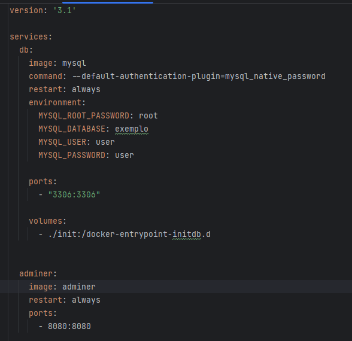

#### Aqui podemos ver as informações do nosso compose.yaml.
` image: ` -  a imagem que será usada para formar o nosso container, neste caso - Mysql

` environment: ` - define o ambiente do nosso MySql como o nome da nossa base, usuários e senhas.

` ports: ` - refere em qual porta o nosso computador conseguirá acessar o contâiner, neste caso a porta 3306 que nos dará acesso a base de dados

` Adminer: ` - uma interface visual para admnistrarmos nossa base via browser.

## Hands on
Rode a aplicação com os comandos demonstrados anteriormente em  `Instale as Dependências` e digite no seu navegador http://localhost:8080 para acessar
a base de dados: 
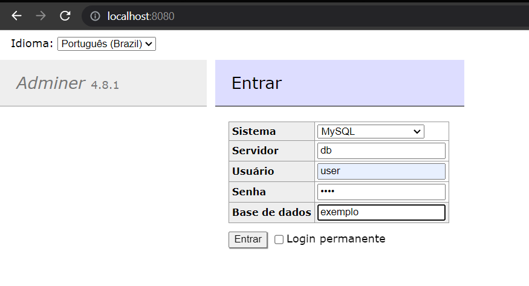

#### Os dados de acesso são aqueles do nosso compose.yaml 

A primeira vista não temos nada aqui: 
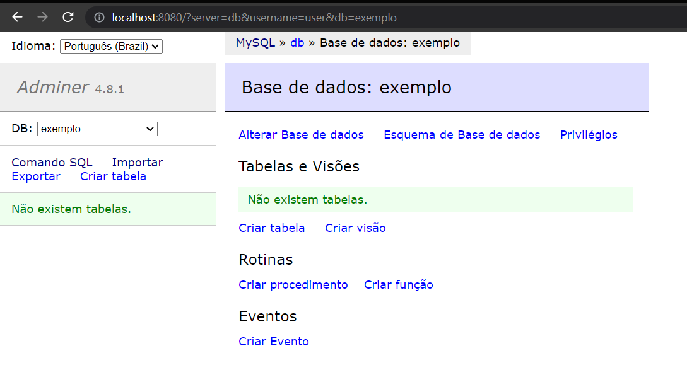

### Mysql container

Em um outro terminal podemos ver que nosso container subiu com sucesso e também podemos executar comandos MySql no mesmo:

##### Lista de containeres ativos:
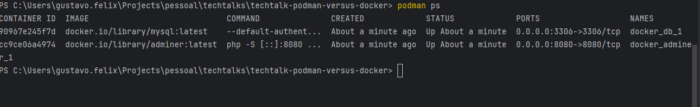

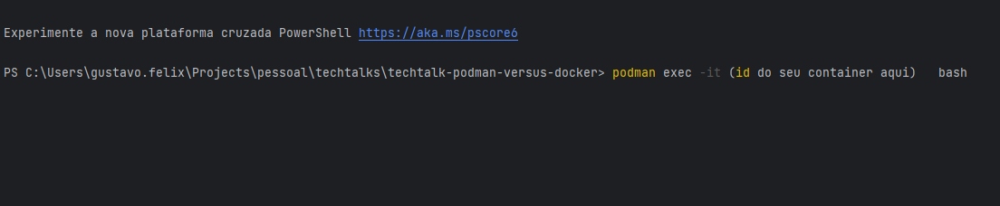
##### Executando comandos Mysql dentro do contâiner.
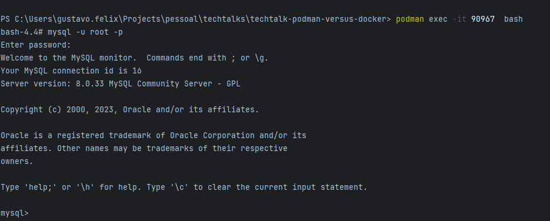

## Ativando nossa aplicação:
No navegador digite `localhost:8096/job` caso houver êxito uma mensagem na tela vai indicar
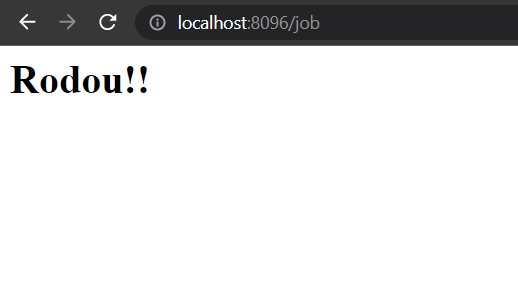

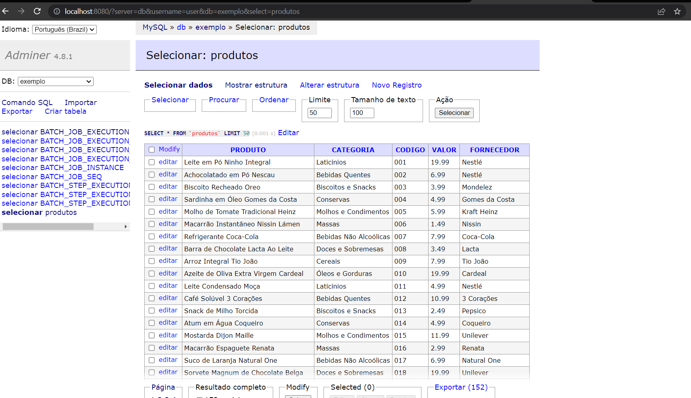

Os itens foram persistidos na base!!!

Docker ou Podman??
====================

Ambas ferramentas são muito boas, na minha experiência com podman deu tudo certo e aprendi a usar a ferramenta
com a documentação oficial do Docker, pesquise as vantagens e as desvantagens de cada um e faça seu balaço.

Slides da apresentação: 
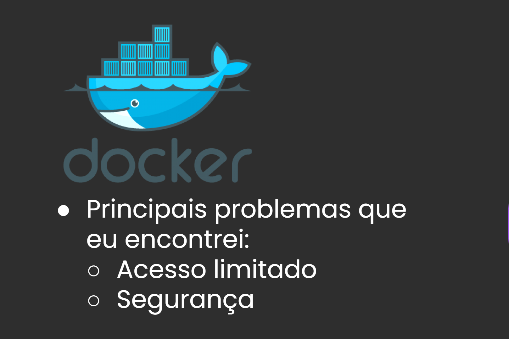
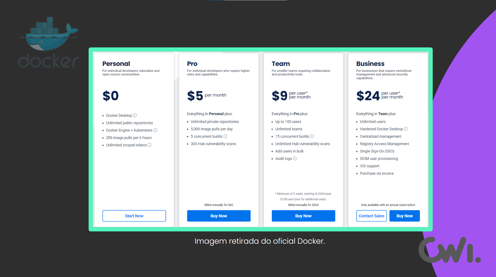
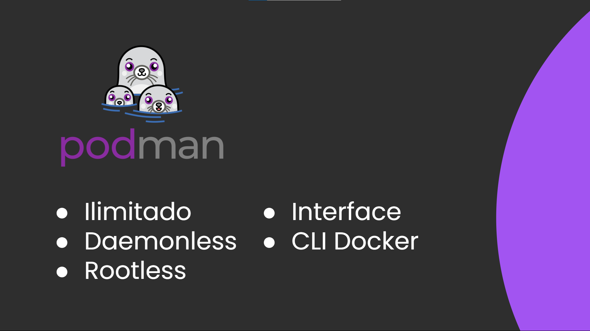
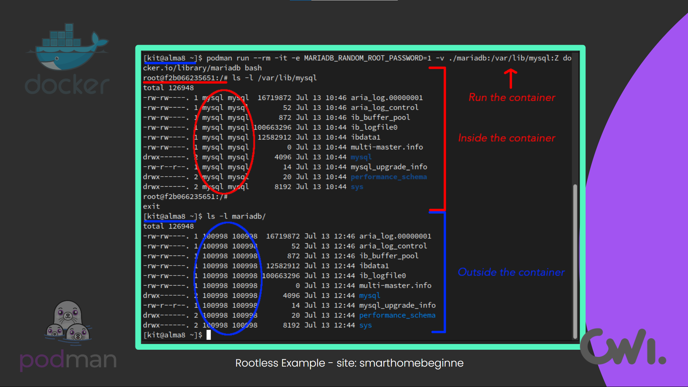
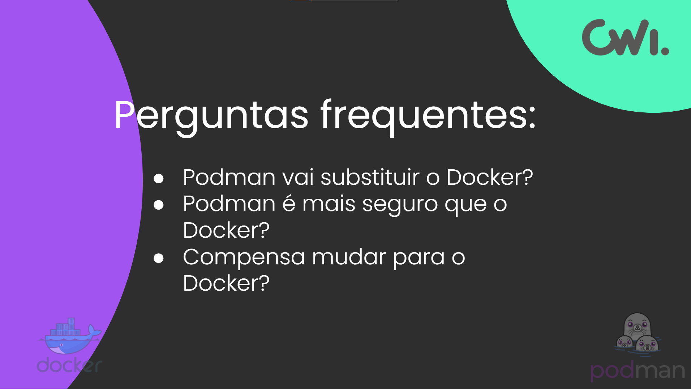
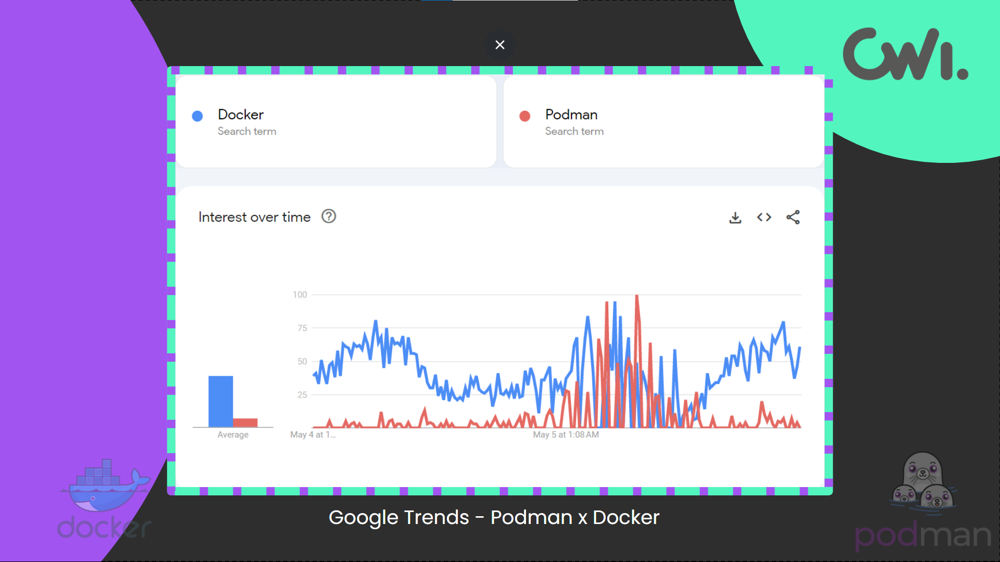